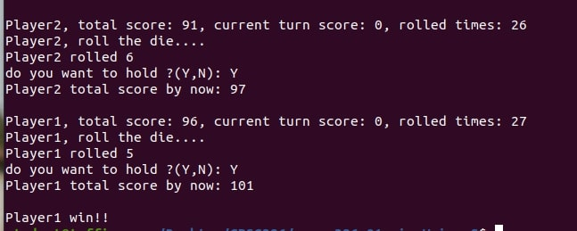

## Game Intro
This is a classic dice game called "Pig". Each player will take turns to roll the die until their total score reaches 100 or more.

## Rules
- Designed for 1-4 players, you can play against the computer or other players.
- 6-sided die (the faces of the die are numbered 1, 2, 3, 4, 5, and 6/ opposing sides of the die sum to 7)
- Game ends when anyone ends their turn with a score of 100 or more
- The player who goes first is selected by each player rolling the die once. The players are ordered in ascending order.
- If the player rolls 1, the player scores 0 that turn and it will be next player's turn.
- If the player rolls 2-6, the value of the die is added to their turn's score.
- If a player chooses Yes, current turn's score will be added to total score, it's next player's turn.
- If a player chooses No, there will be one more chance to roll.(if you roll 1, you lost your current turn's score, and it will be next player's turn)
- The play may not choose to hold until after the die has been rolled at least once.

## Game play

